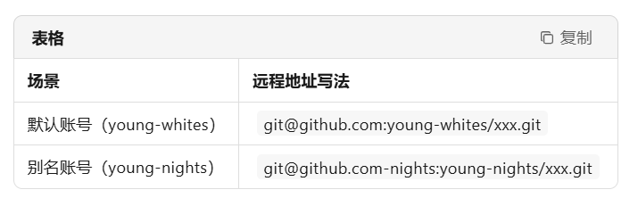

<style>
.red {
  color: #ff0000;
}
.blue {
  color:rgb(0, 162, 225);
}
.mazarine {
  color:rgb(17, 0, 255);
}
</style>


# <span class="blue"><font size=3>Github中拉去代码相关的指令说明</font></span>
<font size=2>在Github上拉取特定版本的代码时，可以通过指定分支(Branch)、标签(Tag)或提交哈希(Commit Hash)来实现</font>

```bash
# 拉取特定分支/标签（如master、develop等）
git clone -b <branch-name> <link>

# 比如拉取rt-thread的4.1版本的源码
git clone -b lts-v4.1.x git@github.com:RT-Thread/rt-thread.git
```


# <span class="blue"><font size=3>在同一电脑上管理多个Github账号</font></span>
<font size=2>在同一电脑上管理多个Github账号时，可以在电脑上配置一个"默认钥匙"，也即"全局密钥"，本人使用的笔记本电脑中默认配置<span class="red">"young-whites"</span>这个账号的密钥，然后在<span class="red">./.ssh/config</span>文件中给第二账号起别名（如：<span class="red">github.com-nights</span>），Git会根据远程 URL 中的别名自动选对钥匙，互不干扰。</font>


# <span class="blue"><font size=2>1.全局默认密钥的配置</font></span>

```bash
# 1. 设置Git的用户名(全局)
git config --global user.name "你的用户名"

# 2. 设置Git的邮箱(全局)
git config --global user.email "你的邮箱"

# 3. 查看是否设置成功
git config --global --list

# 4. 生成默认SSH密钥对
ssh-keygen -t ed25519 -C "young-whites Github SSH Key"

# 5. 按提示输入文件保存路径（默认路径为  C:\Users\18452\.ssh\id_rsa）
#    按提示输入密码（可以留空）
#    查看生成的公钥(id_ed25519.pub)内容

# 6. 将公钥添加到 Github
#	1)登录到 Github;
#	2)进入个人设置页面;
#	3)在左侧菜单中选择 SSH公钥;
#	4)点击 添加 SSH 公钥，填写标题并粘贴公钥内容;

# 7. 验证 SSH 连接是否成功
ssh -T git@github.com
				
# 8. 如果显示以下信息，则说明连接成功：
Hi young-whites! You've successfully authenticated, but GitHub does not provide shell access.

```

# <span class="blue"><font size=2>2.管理多账号</font></span>

<font size=2>默认账号继续走 默认钥匙，young-nights 走别名钥匙</font>

```bash
# 1. 生成一个新的 SSH 密钥
ssh-keygen -t ed25519 -C "young-nights Github SSH Key" -f ~/.ssh/id_ed25519_github_nights

# 2. 按提示输入文件保存路径（默认路径为  C:\Users\18452\.ssh\id_rsa）
#    按提示输入密码（可以留空）
#    查看生成的公钥(id_ed25519.pub)内容

# 3. 将公钥添加到 Github
#	1)登录到 Github;
#	2)进入个人设置页面;
#	3)在左侧菜单中选择 SSH公钥;
#	4)点击 添加 SSH 公钥，填写标题并粘贴公钥内容;

# 4. 修改config文件
# young-nights 专用别名
Host github.com-nights
    HostName github.com
    User git
    IdentityFile C:/Users/18452/.ssh/id_ed25519_github_nights

# 其余账号（包括 young-whites 默认）不写任何 Host，
# 直接 git@github.com:... 即可，SSH 会自动找默认钥匙

```
<font size=2>使用场景对照</font>


# <span class="blue"><font size=2>3.验证默认账号</font></span>

<font size=2>本地有一个名为==some_tutorials==的仓库，远程在<span class="red">young-whites</span>账户下也存在一个==some_tutorials==的远程仓库，现在需要将本地仓库与远程仓库关联，并将本地仓库推送到远程仓库。</font>

```bash
# 1. 初始化本地仓库（生成.git）
git init

# 2. 确认全局身份（默认账号 young-whites）
#    如果已经设置过可跳过；不执行 --local 即可沿用全局
git config --global user.name  "young-whites"
git config --global user.email "whites@example.com"

# 3. 把本地仓库关联到远程并推送
# 关联远程（HTTPS 写法）
git remote add origin https://github.com/young-whites/my-project.git
# 或者 SSH 写法（默认钥匙）
git remote add origin git@github.com:young-whites/some_tutorials.git

# 4. 把现有文件加入版本控制
git add .

# 5. 查看缓冲区
git status

# 6. 提交修改
git commit -m "Initial commit"

# 7. 推送
git branch -M main          # 把默认分支改名为 main
git push -u origin main     # 第一次加 -u，后续直接 git push
# 如果确定本地的更改是正确的，并且不需要远程仓库的更改，可以使用强制推送：
git push --force -u origin main

```

# <span class="blue"><font size=2>4.验证别名账号</font></span>
<font size=2>把同一份本地仓库再推到 young-nights（别名账号）的远程仓库，以上面的本地仓库为例。</font>

```bash
# 新增 young-nights 的远程 ( 名字叫 origin )
git remote add nights git@github.com-nights:young-nights/some_tutorials.git
# 推送本地 main 分支到 origin 远程
git push -u nights main
# github.com-nights 对应 SSH 配置里的 Host，会自动用你的 id_rsa_nights_github 私钥。

# 删除 nights 这个远程
git remote remove nights
```


# <span class="blue"><font size=4>删除github的全局设置</font></span>

```bash
# 删除全局用户名
git config --global --unset user.name

# 删除全局邮箱
git config --global --unset user.email
```

以后再进入仓库，就用局部（或按目录）的方式单独设置：
```bash
# 在当前仓库内设置
git config user.name  "张三"
git config user.email "zhangsan@example.com"

```


