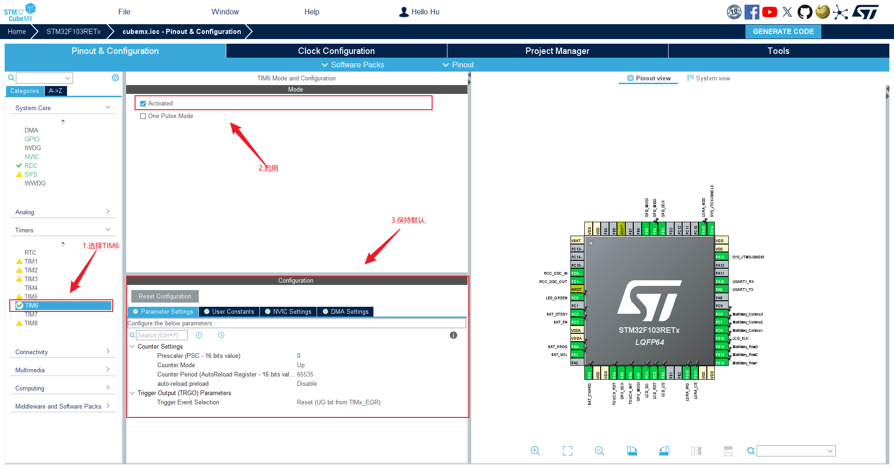
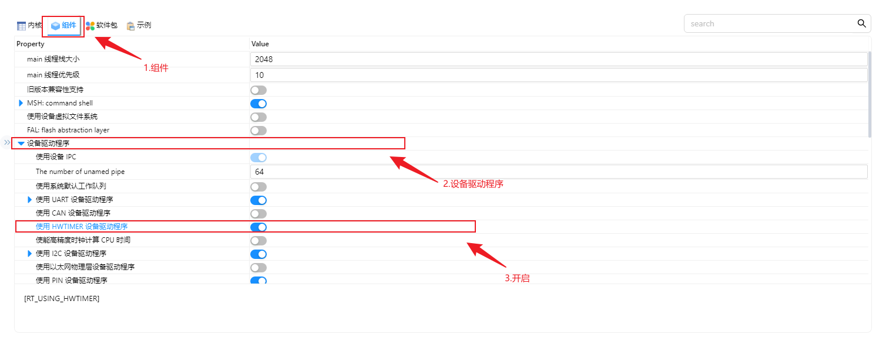
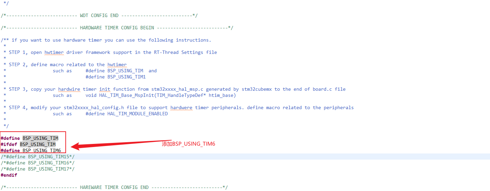
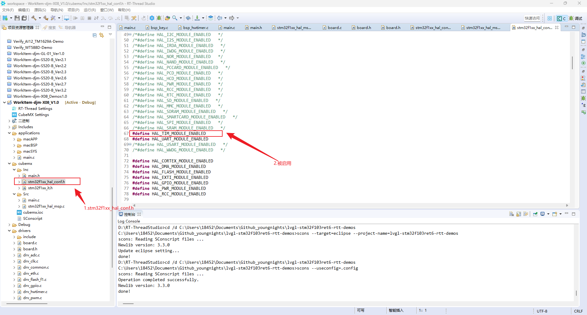
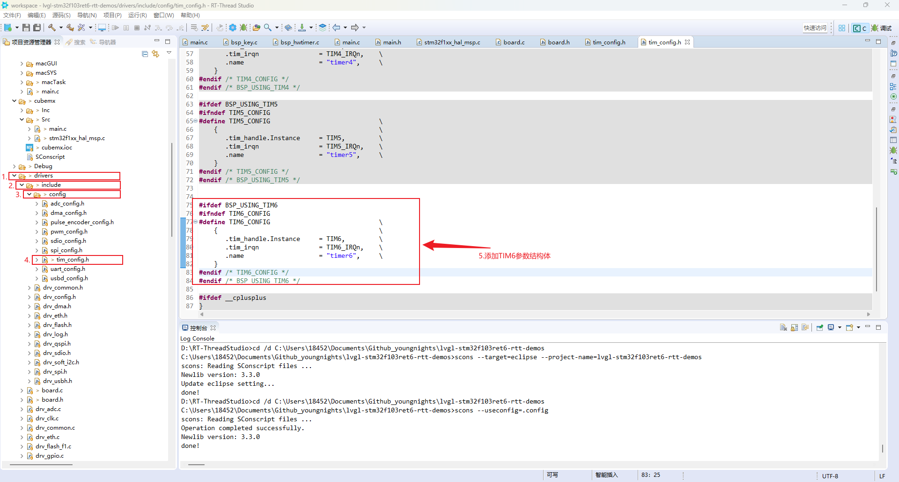
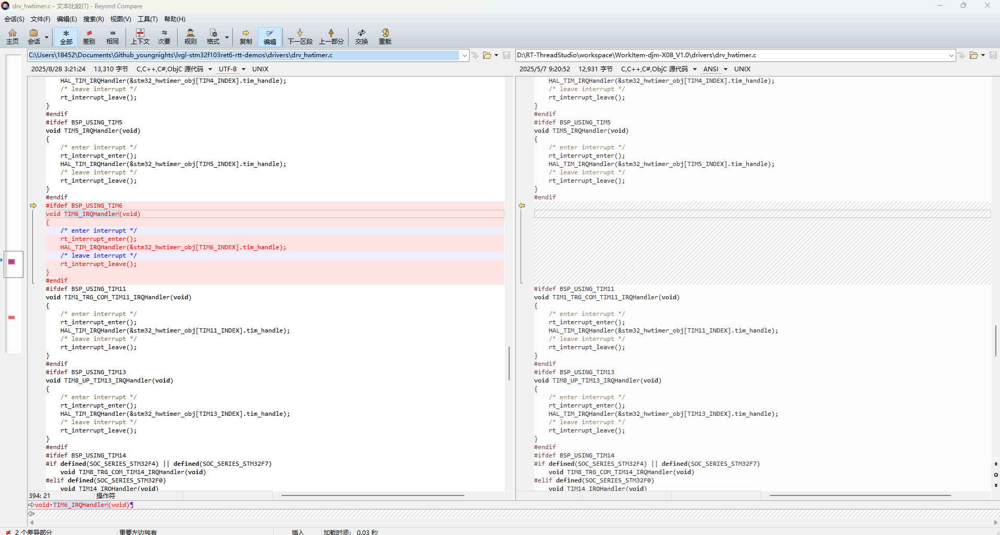
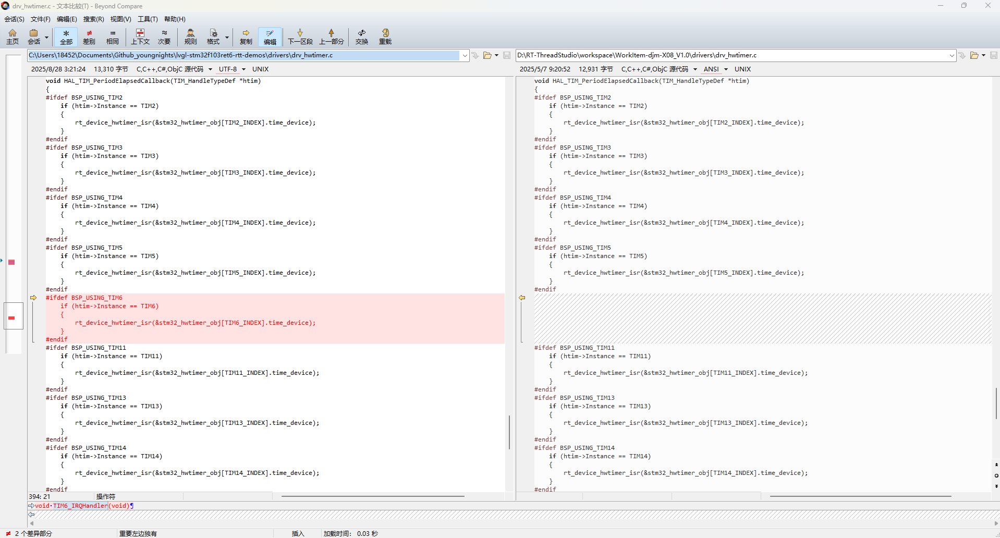

<style>
.red {
  color: #ff0000;
}
.green {
  color:rgb(10, 162, 10);
}
.blue {
  color:rgb(17, 0, 255);
}

.wathet {
  color:rgb(0, 132, 255);
}
</style>

# <span class="green"><font size=3>一、环境选择与配置</font></span>

```bash
create_at： 2025/08/28
aliases：   使用RT-Thread Studio 进行硬件定时器的配置
hardware:   stm32f103ret6
```

## <font size=2>1.CubeMX配置</font>

<font size=2>首先说明一下STM32F103RET6的定时器分类：
基本定时器：TIM6、TIM7
通用定时器：TIM2、TIM3、TIM4、TIM5
高级定时器：TIM1、TIM8
本次测试只使用定时器做中断处理，无需PWM等高级功能，因此选用TIM6基本定时器作为测试对象。

打开RTT中的CubeMX插件，点击Timers，选择TIM6，把配置项中的 Activated 勾选，然后下面的 Configuration 配置项保持默认，生成代码。
</font>


## <font size=2>2.RTT代码修缮</font>

<font size=2>使用CubeMX完成代码生成后，删除会导致程序报错的代码后，对Hard-Timer组件相关的配置进行修改。
配置步骤如下：

1. 点击```RT-Thread Settings```，进入到组件配置，选择设备驱动程序，找到```使用HWTIMER设备驱动程序```，然后开启，保存；


2. 点击```board.h```头文件，找到```HARDWARE TIMER CONFIG BEGIN```配置项，去除```#define BSP_USING_TIM```以及```#ifdef BSP_USING_TIM```的注释，然后添加```#define BSP_USING_TIM6```内容；


3. 在cubemx生成的文件夹中找到```stm32f1xx_hal_conf.h```，查看```#define HAL_TIM_MODULE_ENABLED```是否被启用，这里需要被启用；


4. 进入```drivers文件夹 --> include文件夹 --> config文件夹 --> tim_config.h```，官方定义的宏中，缺少关于TIM6相关的配置结构体，所以需要自己添加，这里参考TIM2~TIM5的结构体内容进行添加即可。
```C
#ifdef BSP_USING_TIM6
#ifndef TIM6_CONFIG
#define TIM6_CONFIG                             \
    {                                           \
       .tim_handle.Instance     = TIM6,         \
       .tim_irqn                = TIM6_IRQn,    \
       .name                    = "timer6",     \
    }
#endif /* TIM6_CONFIG */
#endif /* BSP_USING_TIM6 */
```


5. 进入```drivers文件夹 --> drv_hwtimer.c```，官方源文件中没有TIM6的 TIM6_IRQHandler 函数 以及 isr 函数，因此在 drv_hwtimer.c 以及 HAL_TIM_PeriodElapsedCallback 函数 中添加以下代码；
```c
#ifdef BSP_USING_TIM6
// 在 drv_hwtimer.c 任意位置添加即可
void TIM6_IRQHandler(void)
{
    /* enter interrupt */
    rt_interrupt_enter();
    HAL_TIM_IRQHandler(&stm32_hwtimer_obj[TIM6_INDEX].tim_handle);
    /* leave interrupt */
    rt_interrupt_leave();
}
#endif
```

```C
// 在HAL_TIM_PeriodElapsedCallback()函数中添加
#ifdef BSP_USING_TIM6
    if (htim->Instance == TIM6)
    {
        rt_device_hwtimer_isr(&stm32_hwtimer_obj[TIM6_INDEX].time_device);
    }
#endif
```

</font>

6. 


## <font size=2>3.驱动代码</font>

<font size=2>仿照如下代码进行编写即可。</font>
```C
#define HWTIMER6_DEV_NAME    "timer6"    /* 定时器名称 */
rt_device_t hw6_dev = RT_NULL;           /* 定时器设备句柄 */
rt_hwtimerval_t timeout_s;               /* 定时器超时值 */

/* 定时器超时回调函数 */
static rt_err_t timeout_cb(rt_device_t dev, rt_size_t size)
{


    rt_device_read(hw6_dev, 0, &timeout_s, sizeof(timeout_s));
    rt_kprintf("Read: Sec = %d, Usec = %d\n", timeout_s.sec, timeout_s.usec);
    return 0;
}


int hwtimer6_init(void)
{
    rt_err_t ret = RT_EOK;

    /* 定时器模式 */
    rt_hwtimer_mode_t mode;
    /* 计数频率 */
    rt_uint32_t freq = 1000000;

    /* 查找定时器设备 */
    hw6_dev = rt_device_find(HWTIMER6_DEV_NAME);
    if (hw6_dev == RT_NULL)
    {
        rt_kprintf("hwtimer sample run failed! can't find %s device!\n", HWTIMER6_DEV_NAME);
        return RT_ERROR;
    }

    /* 以读写方式打开设备 */
    ret = rt_device_open(hw6_dev, RT_DEVICE_OFLAG_RDWR);
    if (ret != RT_EOK)
     {
         rt_kprintf("open %s device failed!\n", HWTIMER6_DEV_NAME);
         return ret;
     }

    /* 设置超时回调函数 */
    rt_device_set_rx_indicate(hw6_dev, timeout_cb);

    /* 设置计数频率(默认1Mhz或支持的最小计数频率) */
    ret = rt_device_control(hw6_dev, HWTIMER_CTRL_FREQ_SET, &freq);
    if (ret != RT_EOK)
    {
        rt_kprintf("set frequency failed! ret is :%d\n", ret);
        return ret;
    }

    /* 设置模式为周期性定时器 */
    mode = HWTIMER_MODE_PERIOD;
    ret = rt_device_control(hw6_dev, HWTIMER_CTRL_MODE_SET, &mode);
    if (ret != RT_EOK)
    {
        rt_kprintf("set mode failed! ret is :%d\n", ret);
        return ret;
    }


    /* 设置定时器超时值为10ms并启动定时器 */
    timeout_s.sec = 1;      /* 秒 */
    timeout_s.usec = 0;  /* 微秒 */

    if (rt_device_write(hw6_dev, 0, &timeout_s, sizeof(timeout_s)) != sizeof(timeout_s))
    {
        rt_kprintf("set timeout value failed\n");
        return RT_ERROR;
    }

    /* 读取定时器当前值 */
      rt_device_read(hw6_dev, 0, &timeout_s, sizeof(timeout_s));
      rt_kprintf("Read: Sec = %d, Usec = %d\n", timeout_s.sec, timeout_s.usec);

      return ret;
}
INIT_APP_EXPORT(hwtimer6_init);
```


