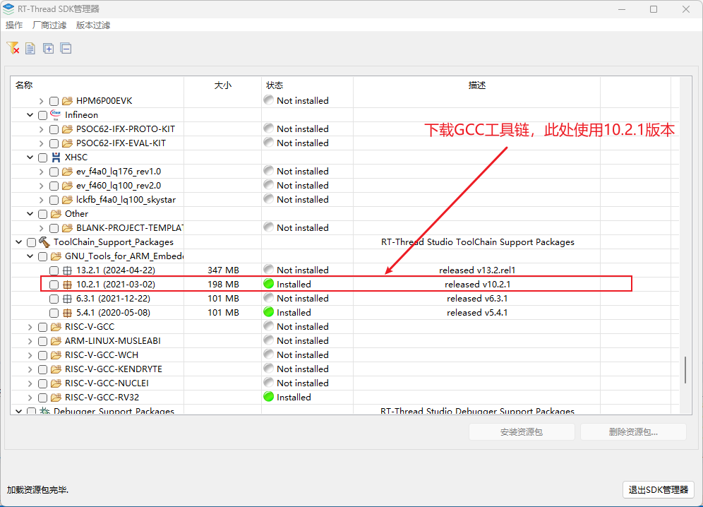
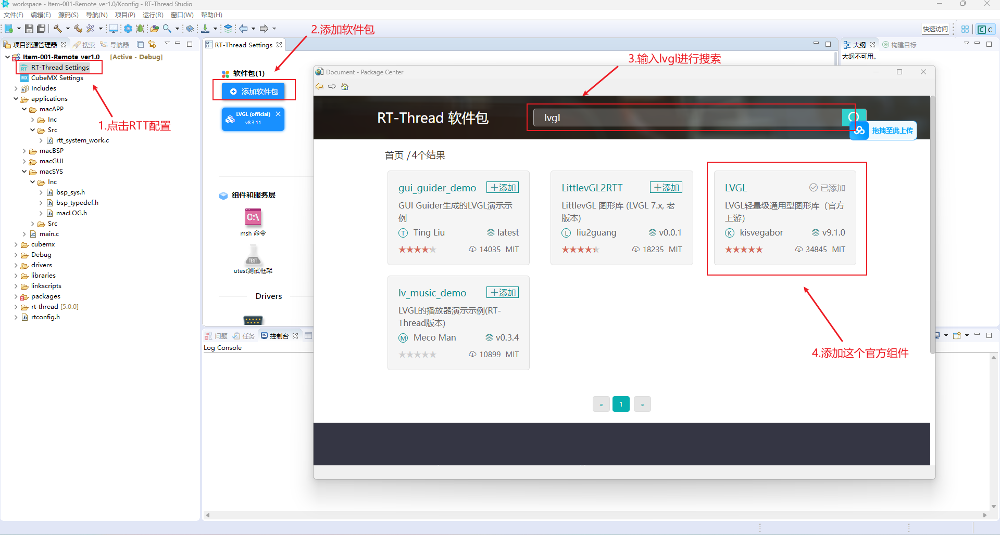

<style>
.red {
  color: #ff0000;
}
.green {
  color:rgb(10, 162, 10);
}
.blue {
  color:rgb(17, 0, 255);
}

.wathet {
  color:rgb(0, 132, 255);
}
</style>


# <span class="green"><font size=3>一、环境选择与配置</font></span>
```bash
create_at：2025/06/29
aliases：使用RT-Thread Studio 进行LVGL组件的添加与移植
```
## <font size=2>1.下载高版本RT-Thread源代码</font>

<font size=2>在 RT-Thread Studio 的 SDK Manager 中下载 RT-Thread_Source_Code 版本在==4.1.0及以上==版本，方可支持在Packages软件包中进行LVGL源码的下载与组件的添加。否则会产生当前rt-thread的版本错误，不支持添加LVGL软件版的提示。</font>


## <font size=2>2.下载高版本GCC工具链</font>
<font size=2>同时，在 RT-Thread Studio 的 SDK Manager 中下载 ToolChain_Support_Packages 的 GUN_Tools_for_ARM_Embedded_Processors 的 10.2.1 版本，默认是 5.4.1 版本，这个默认版本太低了，使用RTT源码在4.1.0以上时会产生报错。</font>



## <font size=2>3.添加lvgl官方源码</font>
<font size=2>接下来就可以正常添加lvgl的组件了。</font>


# <span class="green"><font size=3>二、代码移植</font></span>
## <font size=2>1.ST7789显示屏驱动代码移植</font>

