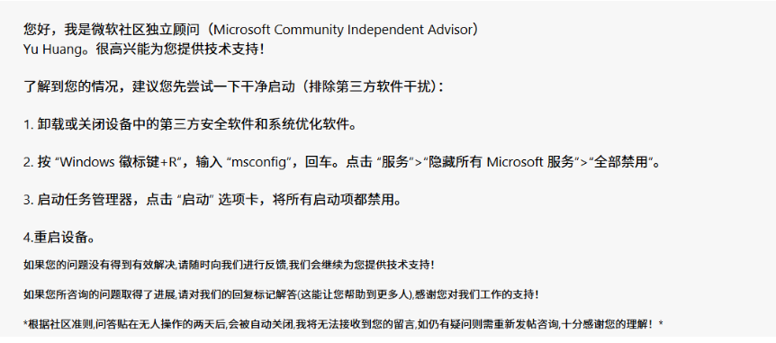
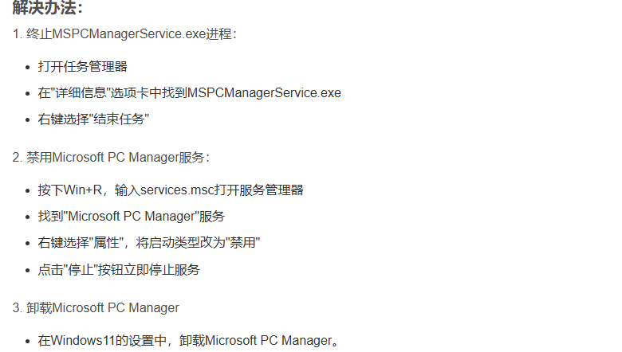

## 1.使用RT-Thread Studio编译代码速度变的极慢

遇到的问题：同样在使用Windows11系统下的台式电脑和笔记本电脑配置都不弱的情况下，使用RT-Thread Studio对编写的代码进行编译时，编译速度有明显的差异。台式机的配置为远高于笔记本的情况下，台式机居然编译了2-3分钟，而笔记本电脑只编译了1分钟不到，这明显是不对的。

问题排查：在网上找了几个方法：
方法一：电脑自带的windows安全中心会对电脑运行的文件进行检查，这导致原来编译一份代码的速度变得十分缓慢，不仅仅编译缓慢，输入数据运行也变得很慢。
方法二：打开任务管理器，发现CPU在编译时只有一个核被占用，猜测可能是Windows的更新对多核编译的调度策略产生了影响，问题可能出在MSPCManager Service这个服务上面。
方法三：关闭所有后台隐藏服务。

排除方法一：第三方杀毒软件在编译代码时会对生成文件进行扫描，进而影响编译或者运行速度的问题首先排除，因为两台电脑均是使用的火绒安全，防火墙开启状态，但是依旧有这么大的差异，所以排除此选项。
排除方法二：打开任务管理器，在"详细信息"选项卡中找到 MSPCManagerService.exe，右键选择"结束任务"。然后编译代码，代码编译速度依旧很慢。注意：第二种方法没有测试完，后续还有禁用以及卸载Microsoft PC Manager服务操作没有测试，因此不能完全断定是这个导致的。

解决方法：使用方法三，成功解决问题。造成原因有可能是后期安装的一些软件或者插件在系统配置里会默认开机自启动，然后挂在后台运行，占用系统资源。

## 2025-08-07补充：

方法三：弃用。使用这个方法虽然可以解决编译速度问题，但是禁用了很多其他软件的服务项，会影响软件的使用。

解决方法，实际还是验证了方法二，在任务管理器中调出 MSPCManagerService.exe 的线程，可以看到，当运行编译RT-Thread时，该线程对CPU的占用率飙升到了15%左右，结束该线程，编译迅速完成。可以判断，确实是这个组件策略影响的。

操作步骤如图：

