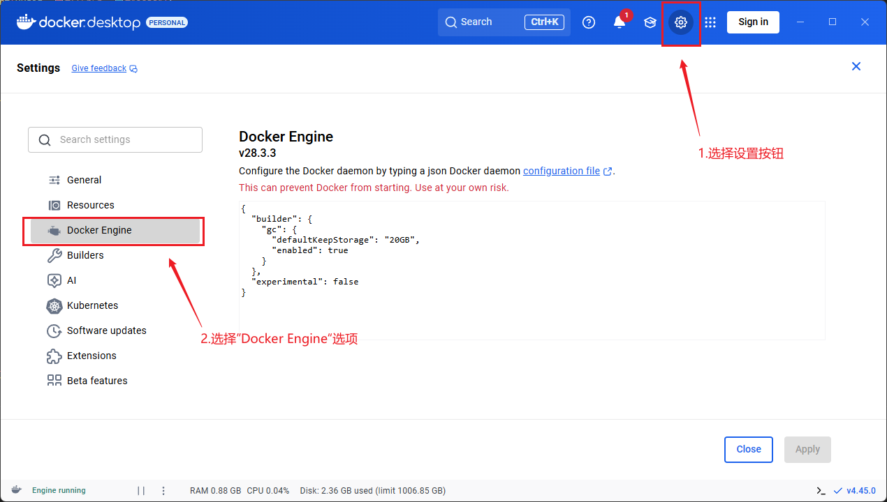
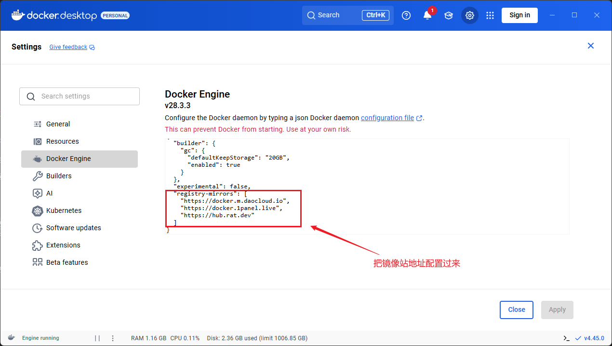

<style>
.highlight{
  color: white;
  background: linear-gradient(90deg, #ff6b6b, #4ecdc4);
  padding: 5px;
  border-radius: 5px;
}

.mint_green{
  color: white;
  background: #adcdadf2; 
  padding: 5px;
  border-radius: 5px;
}

.red {
  color: #ff0000;
}
.green {
  color:rgb(10, 162, 10);
}
.blue {
  color:rgb(17, 0, 255);
}

.wathet {
  color:rgb(0, 132, 255);
}
</style>


# <span class="wathet"><font size=4>Windows Docker Desktop 网络配置 </font></span>
<font size=3>

<span class="blue">1. 找到Docker-Desktop的配置页面</span>



<span class="blue">2. 配置镜像源地址</span>

```bash
# 把这个部分粘贴复制到 Docker Engine 中
"registry-mirrors": [
    "https://docker.m.daocloud.io",
    "https://docker.1panel.live",
    "https://hub.rat.dev"
]
```


</font>


