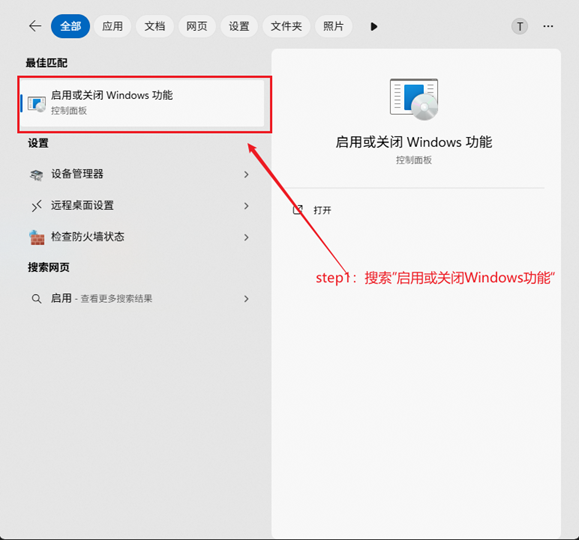
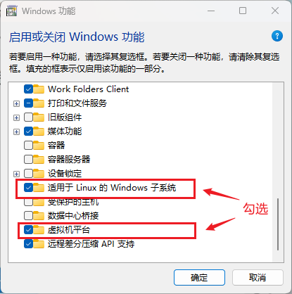

<style>
.highlight{
  color: white;
  background: linear-gradient(90deg, #ff6b6b, #4ecdc4);
  padding: 5px;
  border-radius: 5px;
}

.mint_green{
  color: white;
  background: #adcdadf2; 
  padding: 5px;
  border-radius: 5px;
}

.red {
  color: #ff0000;
}
.green {
  color:rgb(10, 162, 10);
}
.blue {
  color:rgb(17, 0, 255);
}

.wathet {
  color:rgb(0, 132, 255);
}
</style>


# <span class="wathet"><font size=4>Windows电脑上安装配置Docker</font></span>
## <font size=3>一、软件安装 & 环境配置</font>
<font size=2>

- <span class="blue">在任务栏搜索"启用或关闭Windows功能"</span>



- <span class="blue">勾选 "虚拟机平台" 和 "适用于Linux的Windows子系统"</span>



- <span class="blue">更改完配置重启电脑后，安装WSL，管理员身份打开cmd，输入以下指令</span>

```bash
# 1. 把 WSL 的默认版本设置成2
wsl --set-default-version 2
# 2. 安装 WSL
wsl --update --web-download
```

- <span class="blue">安装 Docker Desktop</span>
[Docker-Desktop官方下载链接](https://www.docker.com/)


- <span class="blue">可选：指定安装目录</span>

```bash
# 参数  --installation-dir=D:\Docker  可以指定安装位置
start /w "" "Docker Desktop Installer.exe" install --installation-dir=D:\Docker 
```


</font>


## <font size=3>二、Docker的常用指令</font>
<font size=2>

```bash
# 1. 从仓库拉取镜像
docker pull
```


</font>
