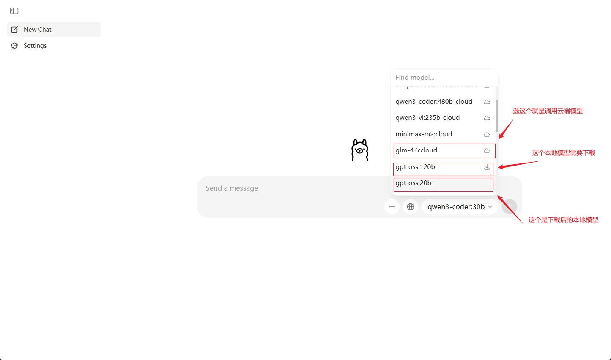
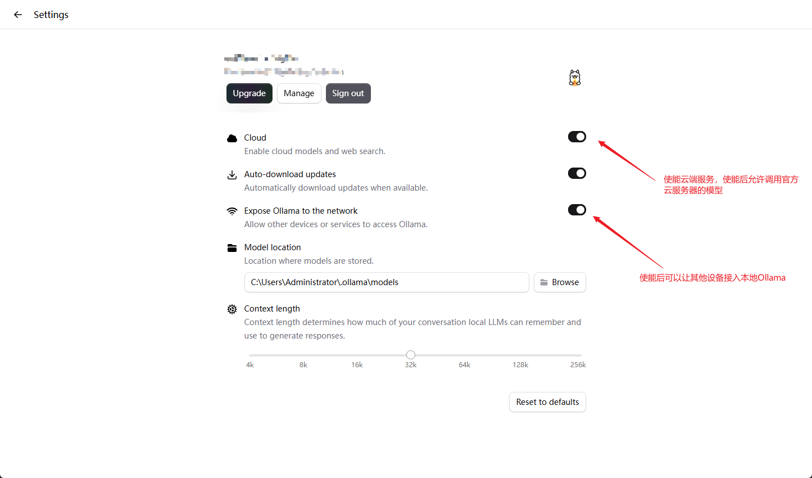

#  Ubuntu 下的 Ollama 的本地部署 

##  简要概述 

Ollama 是一个本地大模型运行框架，无需复杂的配置就能在个人电脑或服务器上运行 Llama、Mistral、DeepSeek 等开源大模型，无需联网、无需 API 密钥、数据完全本地。

 

##  部署前准备 

Ollama官网下载：[官网链接](https://ollama.com/)

##  软件安装 

在官网下载Windows版本的 Ollama.exe 安装包，然后双击运行安装.

安装完成后，直接显示界面如下.

安装完成后，根据需求设置Ollama.

