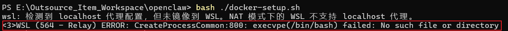
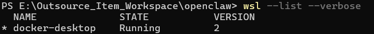
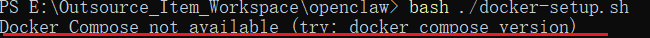
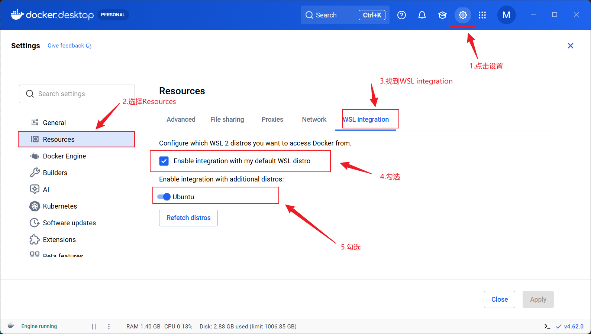
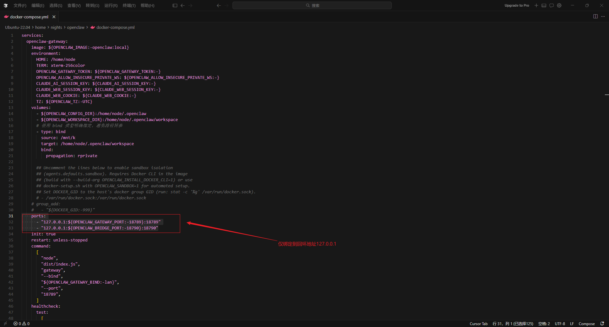
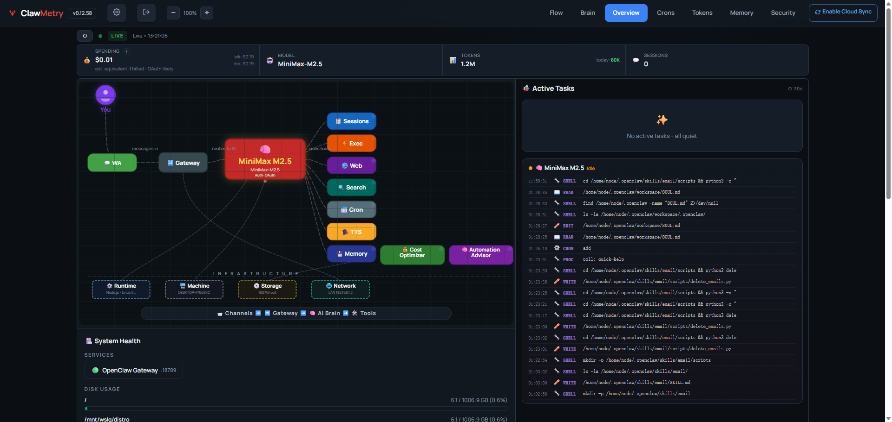
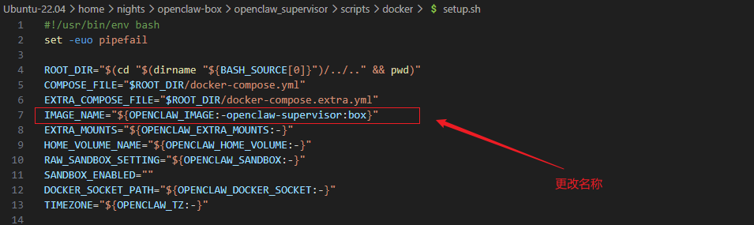
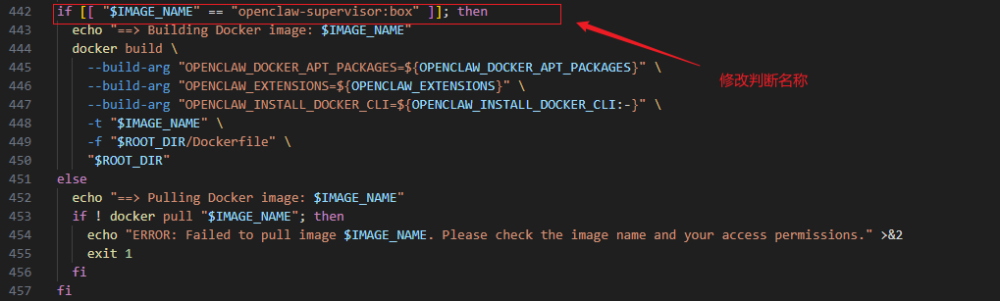
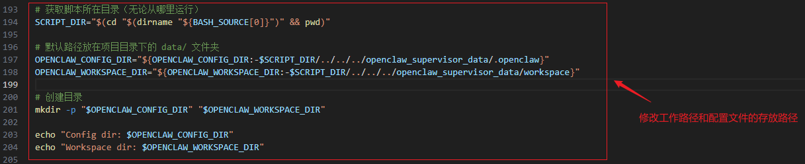

<style>
.highlight{
  color: white;
  background: linear-gradient(90deg, #ff6b6b, #4ecdc4);
  padding: 5px;
  border-radius: 5px;
}

.mint_green{
  color: white;
  background: #adcdadf2; 
  padding: 5px;
  border-radius: 5px;
}

.red {
  color: #ff0000;
}
.green {
  color:rgb(10, 162, 10);
}
.blue {
  color:rgb(17, 0, 255);
}

.wathet {
  color:rgb(0, 132, 255);
}
</style>

# <span class="wathet"><font size=4> Windows 下的 OpenClaw 的本地部署 </font></span>

## <span class="wathet"><font size=3> 简要概述 </font></span>

<div style="background:#e8f5e8;padding:10px;border-radius:6px;color:#333;">

<font size=2>
OpenClaw 的核心卖点就是“能够操作电脑文件、跑命令、整理资料”，所以它设计上就是要访问文件的。但是如果让 openclaw 直接部署在宿主机，也就是使用者常用的 Windows 环境中，存在很高的安全风险，因此需要把 openclaw 部署进行隔离。
</font>
</div>

<br>

## <span class="wathet"><font size=3> 部署前准备 </font></span>

<div style="background:#e8f5e8;padding:10px;border-radius:6px;color:#333;">

<font size=2>

- **Docker Desktop：** 推荐启用 WSL2 后端，以获得更好性能和兼容性
- **Git：** 用于克隆仓库
- **Windows特定注意：** Docker Desktop 会自动处理路径映射，但 Windows 路径使用反斜杠（\），在 Docker Compose 中需转换为正斜杠（/）。如果使用 WSL2，确保 WSL2 已启用（在 PowerShell 中运行 wsl --install）
- **权限：** 以管理员身份运行命令提示符或 PowerShell

```bash
# 1. 查看已安装的 WSL 发行版
wsl --list --verbose

# 2. 查看可安装的发行版列表
wsl --list --online

# 3.  删除 WSL 虚拟机
# 3.1 先关闭 WSL
wsl --shutdown

# 3.2 卸载（删除）指定发行版
wsl --unregister Ubuntu-22.04

# 4.  查看可用的 Ubuntu 版本
wsl --list --online

# 4.1 安装特定版本（例如 Ubuntu 22.04）
wsl --install -d Ubuntu-22.04

# 5. 设置Ubuntu为默认打开
wsl --setdefault Ubuntu-22.04

# 6.  更新系统并安装基础依赖
sudo apt update && sudo apt install -y curl git wget

# 7.  安装 Node.js 22（必须此版本）
curl -fsSL https://deb.nodesource.com/setup_22.x | sudo -E bash -
sudo apt install -y nodejs

# 7.1 验证安装
node -v    # 应显示 v22.x
npm -v

# 9. 下载openclaw源码


# 进入openclaw的容器内部
docker compose exec openclaw-gateway sh

```


### **<span class="wathet"><font size=2> Step1：克隆 OpenClaw 仓库**</font></span>

1. 打开 PowerShell 或 命令提示符
2. 克隆官方仓库 & 进入仓库目录

```bash
# 1. 克隆仓库
git clone https://github.com/openclaw/openclaw

# 2. 进入仓库目录
cd openclaw

# 3. 查询可用版本

```

### **<span class="wathet"><font size=2> Step2：设置 Docker 脚本**</font></span>
OpenClaw 提供了一个脚本 `docker-setup.sh` 来自动化构建和启动 Docker 环境。这会构建 gateway 镜像、运行 onboarding 向导，并通过 Docker Compose 启动服务。

1. 运行 docker-setup.sh

```bash
# 进入到openclaw文件夹
./docker-setup.sh
```
<div style="background:#ffcc99;padding:10px;border-radius:6px;color:#333;">

**<span class="red">报错： 此处运行  bash ./docker-setup.sh 会出现报错</span>**



```bash
# 1. 在Powershell中执行查看默认发行版本
wsl --list --verbose
```


```text
分析报错原因：
(1) docker-desktop 是 Docker Desktop 自动创建的极简 WSL 发行版（基于轻量工具链，比如 busybox 或 scratch 风格），它故意没有安装 /bin/bash（或其他完整 shell），目的是只跑 Docker 引擎的后端，不用于交互。
(2) Windows 把这个 docker-desktop 设成了默认 WSL distro（星号 * 表示默认）
(3) 任何时候你运行 bash、wsl（无参数）、或某些工具（如 OpenClaw/clawdock 的脚本）试图启动 bash 时，WSL relay 层就会去调用默认 distro 的 /bin/bash → 不存在 → 报错.
```

**<span class="green">解决问题方法：</span>**

```bash

# 1. 查看可安装的 Ubuntu 版本
wsl --list --online

# 2. 安装Ubuntu 22.04 LTS
wsl --install -d Ubuntu-22.04
# 这会从 Microsoft Store 下载并安装最新的 Ubuntu
# 安装完后，它会自动启动一次，让你设置用户名和密码

# 3. 把 Ubuntu 设置成默认
wsl --set-default Ubuntu-22.04

# 3. 启动 wsl中的 Ubuntu
wsl -d Ubuntu-22.04
# 4. 查看版本信息
lsb_release -a

# 5. 再次运行 ./docker_setup.sh
./docker_setup.sh 
```

**<span class="red">Docker Compose not available 报错</span>**



```text
问题分析：
OpenClaw 的 docker-setup.sh 脚本在检查 Docker Compose 时，用的是旧语法 docker-compose（V1 版本）。
但现代 Docker Desktop（4.10+ 以后，默认启用 Compose V2）用的是插件形式：命令是 docker compose（无连字符），而不是 docker-compose。
所以脚本检测不到旧的 docker-compose 命令 → 报错退出。

解决方案（在WSL Ubuntu 里操作）：
setp1：先确认 Docker Desktop 已运行，且 WSL 集成已开启（Docker Desktop → Settings → Resources → WSL Integration → 勾选你的 Ubuntu）
step2：重启 Docker Desktop
```



**<span class="red">wsl代理网络问题</span>**

wsl: 检测到 localhost 代理配置，但未镜像到 WSL。NAT 模式下的 WSL 不支持 localhost 代理。
```text
原因分析:
由于 Windows 主机开启了本地代理（localhost 代理，比如 Clash、V2Ray、Shadowsocks 等工具设置的系统代理，通常是 127.0.0.1:1080/7890 等端口），WSL 默认用 NAT 网络模式，localhost (127.0.0.1) 在 Windows 和 WSL 之间不互通，所以 WSL 无法自动使用 Windows 的代理。

修复方式：
在 Windows 用户目录下创建或编辑 .wslconfig 文件，路径：C:\Users\你的用户名\.wslconfig，然后在 .wslconfig 中填写以下内容并保存

[experimental]
autoMemoryReclaim=gradual
networkingMode=mirrored
dnsTunneling=true
firewall=true
autoProxy=true

保存后，在 PowerShell（管理员）运行：

wsl --shutdown

之后，再次打开wsl，或者 bash，警告就会消除

```


**<span class="red">Openclaw的网络访问地址IP的修改</span>**


</div>


### **<span class="wathet"><font size=2> Step3：启用官方 Sandbox 模式**</font></span>

Sandbox 模式使用 Docker 容器隔离代理工具（如 exec、read、write），防止 AI 操作影响主机。默认下，它不要求 gateway 完全在 Docker 中运行，但既然你选择 Docker 部署，它会无缝集成。


### **<span class="wathet"><font size=2> Step4：挂载Windows下的盘符到openclaw**</font></span>


### **<span class="wathet"><font size=2> Step5：网络绑定到localhost本地网络**</font></span>

```bash
# 修改docker-compose.yaml文件
# "主机IP:主机端口:容器端口"

- "127.0.0.1:${OPENCLAW_GATEWAY_PORT:-18789}:18789"
- "127.0.0.1:${OPENCLAW_BRIDGE_PORT:-18790}:18790"

# 实际效果
┌─────────────────┐         ┌─────────────────┐
│     宿主机      │  ←────  │    容器内部     │
│  127.0.0.1:18789 │ ──────→│     :18789      │  (Gateway服务)
│  127.0.0.1:18790 │ ──────→│     :18790      │  (Bridge服务)
└─────────────────┘         └─────────────────┘

```



</font>
</div>


## <span class="wathet"><font size=3> Agent状态监控的UI网页 </font></span>

### **<span class="wathet"><font size=2>ClawMetry**</font></span>

<font size=2> 

ClawMetry 是专为 OpenClaw 设计的开源实时监控面板。

```bash
# 安装
pip install clawmetry

# 檢查 clawmetry 是否真的裝好
ls ~/.local/bin/clawmetry

# 把 ~/.local/bin 加到 PATH
echo 'export PATH="$HOME/.local/bin:$PATH"' >> ~/.bashrc
source ~/.bashrc

# 启动（自动打开 localhost:8900）
clawmetry
```


</font>


## <span class="wathet"><font size=3> 单openclaw，多agnet部署 </font></span>

### **<span class="wathet"><font size=2>部署新智能体**</font></span>

<font size=2> 

```bash

# 全局安裝 openclaw CLI
curl -fsSL https://openclaw.ai/install.sh | bash

# 重启终端
source ~/.bashrc

# 验证是否安装完成
openclaw --version

# 方式一：创建一个新 agent，叫 "coder-agent"，用 Ollama 模型
openclaw agents add coder-agent --model ollama/qwen3-coder:30b --workspace ~/.openclaw/agents/coder-agent-workspace # 独立工作区，防止冲突

# 方式二：如果想交互式创建（会问你一些问题，包括初始 identity）
openclaw agents add coder-agent

```

### **<span class="wathet"><font size=2>删除子agent**</font></span>

```bash
# 先列出所有 agent 确认名称/ID（比如你新建的是 coder-agent）
openclaw agents list

# 删除指定 agent（替换成你的 agent ID/名称，例如 coder-agent）
openclaw agents delete coder-agent

# 如果想强制删除（跳过确认提示）
openclaw agents delete coder-agent --force

```

</font>


## <span class="wathet"><font size=3> 接入Windows本地Ollama </font></span>

<font size=2> 

```bash
# 先列出所有 agent 和它们的模型配置（带 verbose 看细节）
openclaw agents list --verbose

# 用 models 命令检查 Ollama provider 和可用模型列表
openclaw models list --local          # 只看本地模型，应该看到 ollama/ 开头的
openclaw models list --all            # 看全部，包括 Ollama 的
openclaw models status                # 快捷看当前 gateway 连接的模型状态

# 查看ollama是否连通
curl http://host.docker.internal:11434
```

</font>


## <font size=3> 自定义部署openclaw实例需要修改的文件 </font>

### **<font size=2>修改 docker-compose.yaml**</font>

<font size=2> 

```bash
# 1. 网络地址与映射端口的修改
# 原文
ports:
  - "${OPENCLAW_GATEWAY_PORT:-18789}:18789"
  - "${OPENCLAW_BRIDGE_PORT:-18790}:18790"

# 修改后
ports:
  - "127.0.0.1:${OPENCLAW_GATEWAY_PORT:-18789}:18789"
  - "127.0.0.1:${OPENCLAW_BRIDGE_PORT:-18790}:18790"
```


```bash
# 2. Windows下的K盘挂载的修改
# 原文

# 修改后

```


### **<font size=2>修改 `setup.sh`**</font>

```bash
# 1. 更改 docker images 的名称
# 原文
IMAGE_NAME="${OPENCLAW_IMAGE:-openclaw:local}"
# 修改后
IMAGE_NAME="${OPENCLAW_IMAGE:-openclaw-supervisor:box}"
```



```bash
# 2. 更改 docker images 的名称以满足判断要求
# 原文
if [[ "$IMAGE_NAME" == "openclaw:local" ]]; then
# 修改后
if [[ "$IMAGE_NAME" == "openclaw-supervisor:box" ]]; then
```



```bash
# 3. 修改工作路径和配置存放路径
# 原文
OPENCLAW_CONFIG_DIR="${OPENCLAW_CONFIG_DIR:-$HOME/.openclaw}"
OPENCLAW_WORKSPACE_DIR="${OPENCLAW_WORKSPACE_DIR:-$HOME/workspace}"


# 修改后
# 获取脚本所在目录
SCRIPT_DIR="$(cd "$(dirname "${BASH_SOURCE[0]}")" && pwd)"

# 默认路径放在项目目录下的 data/ 文件夹
OPENCLAW_CONFIG_DIR="${OPENCLAW_CONFIG_DIR:-$SCRIPT_DIR/../../../openclaw_supervisor_data/.openclaw}"
OPENCLAW_WORKSPACE_DIR="${OPENCLAW_WORKSPACE_DIR:-$SCRIPT_DIR/../../../openclaw_supervisor_data/workspace}"

# 创建目录
mkdir -p "$OPENCLAW_CONFIG_DIR" "$OPENCLAW_WORKSPACE_DIR"

echo "Config dir: $OPENCLAW_CONFIG_DIR"
echo "Workspace dir: $OPENCLAW_WORKSPACE_DIR"
```




### **<font size=2>添加权限**</font>

```bash
# 1. 
sudo usermod -aG docker $USER
```


</font>
