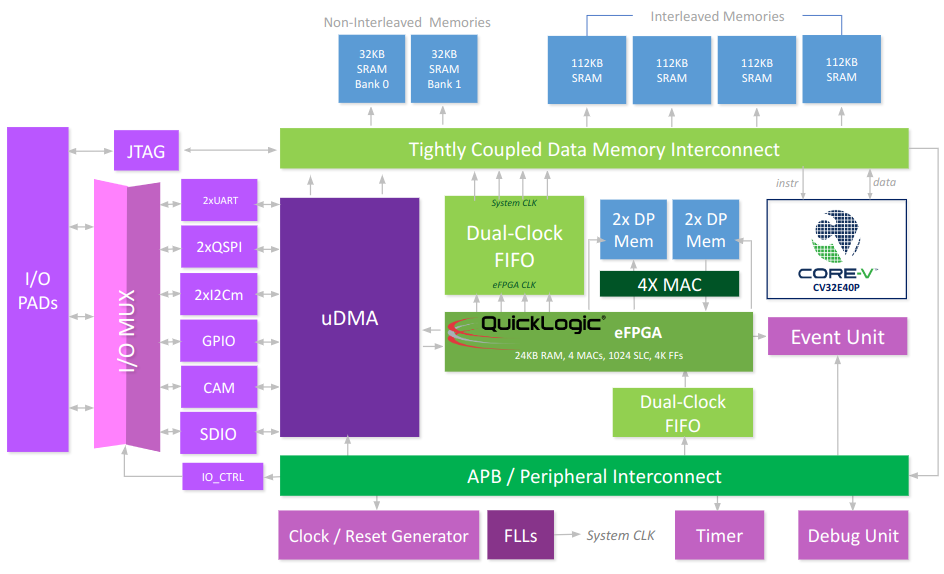
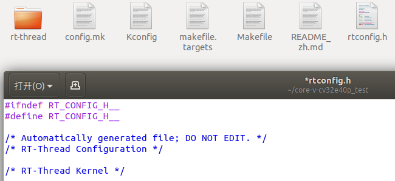
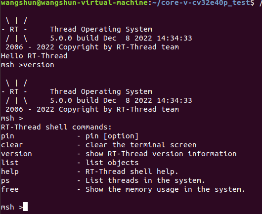
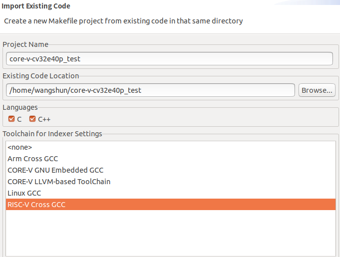
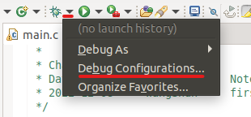
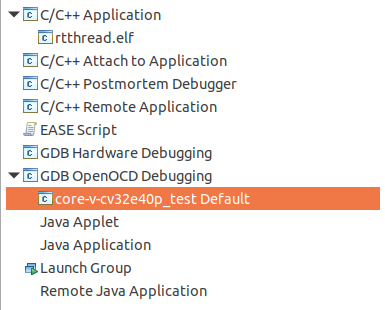
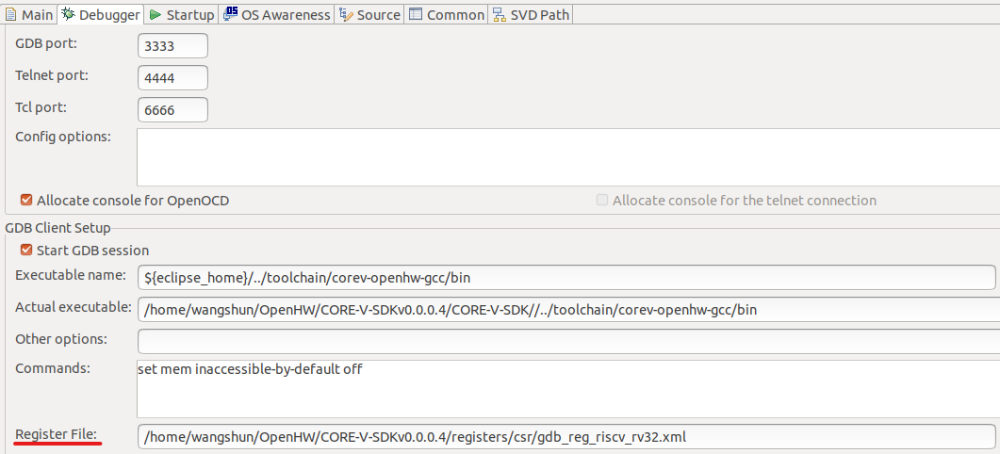

# Core-V-MCU BSP Description

English| [Chinese](readme.md)

## 1 MCU Introduction

The purpose of Core-V-MCU is to show cv32e40p, which is a fully validated RISC-V kernel provided by Open Hardware Group (OpenHW). The cv32e40p core is connected to a group of representative peripherals.



**Core-V-MCU resources：**

- 2xUART
- 2xI2C master
- 1xI2C slave
- 2xQSPI master
- 1xCAMERA
- 1xSDIO
- 4xPWM
- eFPGA with 4 math units

For more information, please visit[Introduction to Core-V-MCU](https://docs.openhwgroup.org/projects/core-v-mcu/doc-src/overview.html)

More resources,please visit[OpenHW official website](https://www.openhwgroup.org/)

## 2 Compilation Description

The board level package supports the RISC-V GCC development environment. The specific version information is as follows:

| IDE/Compiler | Tested version          |
| ------------ | ----------------------- |
| GCC          | riscv32-unknown-elf-gcc |

## 3 Instruction for user

>This chapter is provided for users who use RT Thread on the Core-V-MCU. At present, the Core-V-MCU has no actual hardware and uses QEMU to implement simulation. The qemu used in this article is compiled under the ubuntu18.04 environment.

### 3.1 Compile BSP with Env

This section explains how to use Env tools to compile BSP projects.

#### 3.1.1 编译BSP

1. Preparation 1：[Download GCC compilation tool chain under Linux environment](https://github.com/Yaochenger/openhw-/tree/master/toolchain))，put the downloaded tool chain in your Linux environment.

2. Preparation 2：Install ENV under Linux environment, and run the following command on the console.

   ```shell
   wget https://gitee.com/RT-Thread-Mirror/env/raw/master/install_ubuntu.sh
   chmod 777 install_ubuntu.sh
   ./install_ubuntu.sh --gitee
   ```

3. Preparation 3：Compile [qemu](https://github.com/plctlab/plct-qemu/tree/plct-corev-upstream-sync-dma) provided by PLCT lab in Linux environment,Refer to the compilation method given in README.rst to compile qemu in the Linux environment, or use the[qemu](https://github.com/Yaochenger/openhw-/releases/tag/qemu-linux).

4. Windows environment download RT Thread[最新源码](https://github.com/RT-Thread/rt-thread/archive/refs/heads/master.zip)，This step can also be completed in the Linux environment.

5. Download in the Windows environment Open the Env tool under the current BSP root directory and execute the following command to compile, 'scons -- exec path=tool chain path'. The tool chain under Windows can be downloaded directly using RT Studio. The path of the tool chain is configured according to the user's specific environment. This step can also be completed in the Linux environment. The example command is as follows:

   ```shell
   scons --exec-path=D:\RT-ThreadStudio\repo\Extract\ToolChain_Support_Packages
   \RISC-V\RISC-V-GCC-RV32\2022-04-12\bin
   ```

    Compile directly while specifying the tool chain location, and then generate the rtthread.elf file.

   

6. Try running rtthread.elf, copy the rtthread.elf generated in the previous step to the bin file directory of the compiled qemu tool, and execute the following command:

   ```shell
   ./qemu-system-riscv32 -M core_v_mcu -bios none -kernel rtthread.elf -nographic -monitor none -serial stdio
   ```

   The operation results are as follows:

   

   7.Run the following command to generate a complete, copyable project.

```shell
scons --dist
```

Copy the generated independent project to the Linux environment.

### 3.2Compile and run the project in the Linux environment

#### 3.2.1 Configuration project

1.Found in the complete project root directory copied above**rtconfig.h**,remove the precompiled command from the file**#ifndef RT_CONFIG_H__**,**#define RT_CONFIG_H__**,**#ifndef RT_CONFIG_H__**,**#endif**,be sure to perform this step, or an error will be reported during compilation.



2.Line the following command to generate the makefile project

```shell
scons --target=makefile
```

3.Enter **make ** at the command line to compile the project

4.Run the following command to start qemu and compile rtthread.elf，`/home/wangshun/bin/qemu-riscv/bin/qemu-system-riscv32`is the tool chain path of the Linux environment. It is set here as the user's tool chain path.

```shell
/home/wangshun/bin/qemu-riscv/bin/qemu-system-riscv32 -M core_v_mcu -bios none -kernel rtthread.elf -nographic -monitor none -serial stdio
```

BSP supports the Finsh component of RT-Thread. Enter the command`version` to view the version information of RT-Thread. Click Tap to view the supported commands. The running results are as follows:



So far, the configuration and running test of RT-Thread project based on Core-V-MCU have been completed.

### 3.3 Import the RT Thread project into OpenHW's Core V-IDE

1.Download and Install[core-v-sdk](https://github.com/openhwgroup/core-v-sdk),according [README.md](https://github.com/openhwgroup/core-v-sdk#readme)to install the IDE in a Linux environment。

2.Create a workspace folder in the home directory, and open the IDE to use the workspace folder as the working path.

3.Choose`Import projects Option `:


4.Choose`Existing Code as Makefile Project`:


5.The settings are as follows:

6.Project configuration settings:


7.Modify compilation command:


8.Clear the files compiled from the project and recompile the project:


9.Run the following command in the root directory of the project compiled with IDE, and the result is consistent with that of **3.2.1**. The project under IDE will be configured. So far, the import and running tests of the RT-Thread project imported from IDE to Core-V-MCU have been completed.

### 3.4调试配置

1.Debug Configurations settings:



2.Double click`GDB OpenOCD Debugging`，build debug configuration options:



3.Import on chip peripheral register file:

PATH:`OpenHW/CORE-V-SDKv0.0.0.4/registers/csr`,the specific path is configured according to the SDK path installed by the user。



3.Import on chip peripheral register file:

PATH`/home/wangshun/OpenHW/CORE-V-SDKv0.0.0.4/registers/peripheral`,the specific path is configured according to the SDK path installed by the user.


3.Configure the QEMU running environment:

Cancle`Start OpenOCD locally`，the configuration parameters are as follows:

4.Run the following commands:

```shell
/home/wangshun/bin/qemu-riscv/bin/qemu-system-riscv32 -M core_v_mcu -bios none -kernel rtthread.elf -nographic -monitor none -serial stdio -s -S
```

5.Click debug to start debugging:


### 4.CLI components

​	The FreeRTOS project provided by OPENHW supports a CLI component for testing. To ensure compatibility with the original CLI when using RT Thread again, the original CLI is made into an independent software package. At the same time, the software package automatically opens the FreeRTOS compatibility layer, so the software package can support the original CLI components and still use FreeRTOS interface functions.

#### 4.1使用方法

​	Enable CorevMCU with menuconfig configuration in ENV tool_ CL software package, place the sample code in example. c at the prompt of main. c. The steps to use menuconfig configuration are as follows:

> `RT-Thread online packages`
>    ` miscellaneous packages --->`
>      `   [*] CorevMCU_CLI`