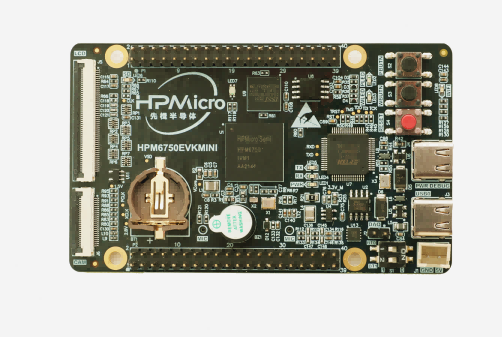

# HPMicro HPM6750EVKMINI BSP(Board Support Package) Introduction

[中文页](README_zh.md) |

## Introduction

This document provides brief introduction of the BSP (board support package) for the HPM6750EVKMINI development board.

The document consists of the following parts:

- HPM6750EVKMINI Board Resources Introduction
- Quickly Getting Started
- Refreences

By reading the Quickly Get Started section developers can quickly get their hands on this BSP and run RT-Thread on the board. More advanced features will be introduced in the Advanced Features section to help developers take advantage of RT-Thread to drive more on-board resources.

## Board Resources Introduction

HPM6750EVKMINI is a development board based on the RISC-V core launched by HPMicro, with rich on-board resources and on-chip resources for Display, Audio， motor control，etc.



## Peripheral Condition

Each peripheral supporting condition for this BSP is as follows:


| **On-board Peripherals** | **Support** | **Note**                              |
| ------------------------ | ----------- | ------------------------------------- |
| USB                      | √           |                                       |
| QSPI Flash               | √           |                                       |
| Ethernet                 | √           | Supported by RT-Thread Industry IO    |
| GPIO                     | √           |                                       |
| SPI                      | √           |                                       |
| I2C                      | √           |                                       |
| SDIO                     | √           |                                       |
| RTC                      | √           |                                       |
| PWM                      | √           |                                       |
| On-Board Debugger        | √           | ft2232                                |


## Execution Instruction

### Quickly Getting Started

The BSP support being build via the 'scons' command, below is the steps of compiling the example via the 'scons' command

#### Parpare Environment
- Step 1: Prepare [RT-Thread ENV](https://www.rt-thread.org/download.html#download-rt-thread-env-tool)
- Step 2: Prepare [toolcahin](https://github.com/helloeagleyang/riscv32-gnu-toolchain-win/archive/2022.04.12.zip)
    - Download the package and extract it into a specified directory, for example: `C:\DevTools\riscv32-gnu-toolchain`
- Step 3: Set environment variable `RTT_RISCV_TOOLCHAIN` to `<TOOLCHAIN_DIR>\bin`
    - For example: `C:\DevTools\riscv32-gnu-toolchain\bin`
- Step 4: Prepare [OpenOCD](https://github.com/hpmicro/rtt-debugger-support-package/archive/v0.3.0.zip)
  - Download and extract it to specified directory, for example: `C:\DevTools\openocd-hpmicro`
  - Add `OpenOCD` environment variable `OPENOCD_HPMICRO` to `<OPENOCD_HPMICRO_DIR>\bin`
    - For example: `C:\DevTools\openocd-hpmicro\bin`

#### Configure and Build project

Open RT-Thread ENV command-line, and change directory to this BSP directory, then users can:

- Configure the project via `menuconfig` in `RT-Thread ENV`
- Build the project using `scons -jN`, `N` equals to the number of CPU cores
- Clean the project using `scons -c`

#### Hardware Connection

- Switch BOOT pin to 2'b00
- Connect the `PWR_DEBUG` port to PC via TYPE-C cable


#### Dowload / Debug

- Users can download the project via the below command:
  ```console
  %OPENOCD_HPMICRO%\openocd.exe -f boards\debug_scripts\probes\ft2232.cfg -f boards\debug_scripts\soc\hpm6750-single-core.cfg -f boards\debug_scripts\boards\hpm6750evkmini.cfg -c "init; halt; flash write_image erase rtthread.elf; reset; shutdown"
  ```

- Users can debug the project via the below command:

  - Connect debugger via `OpenOCD`:

```console
%OPENOCD_HPMICRO%\openocd.exe -f boards\debug_scripts\probes\ft2232.cfg -f boards\debug_scripts\soc\hpm6750-single-core.cfg -f boards\debug_scripts\boards\hpm6750evkmini.cfg
```
  - Start Debugger via `GDB`:

```console
%RTT_EXEC_PATH%\riscv32-unknown-elf-gdb.exe rtthread.elf
```
  - In the `gdb shell`, type the following commands:

```console
load
c
```

### **Running Results**

Once the project is successfully downloaded, the system runs automatically. The LED on the board will flash periodically.

Connect the serial port of the board to the PC, communicate with it via a serial terminal tool(115200-8-1-N). Reset the board and the startup information of RT-Thread will be observed:

```
 \ | /
- RT -     Thread Operating System
 / | \     5.0.1 build Aug 16 2023 18:18:18
 2006 - 2023 Copyright by RT-Thread team
```

## **References**

- [RT-Thread Documnent Center](https://www.rt-thread.org/document/site/#/rt-thread-version/rt-thread-standard/README)
- [RT-Thread Env](https://github.com/RT-Thread/rtthread-manual-doc/blob/master/env/env.md)
- [HPM6750EVKMINI RT-Thread BSP Package](https://github.com/hpmicro/rtt-bsp-hpm6750evkmini)