# i.MX RT 系列外设驱动添加指南

## 1. 简介

本文档是为需要给现有的 i.MX RT BSP 添加更多外设驱动的开发者准备的。通过阅读本文，开发者可以按照自己的实际情况给现有 BSP 添加自己需要的驱动。

## 2. 前提要求

- 熟练使用 ENV 工具，参考：[RT-Thread env 工具用户手册](https://www.rt-thread.org/document/site/#/development-tools/env/env)
- 熟悉 Kconfig 语法
- 熟悉 MCUXpresso 工具
- 对 RT-Thread 设备驱动框架有一定了解

## 3. 如何添加更多的外设驱动选项

本章节以添加片上外设驱动为例，讲解如何为 BSP 添加更多可用驱动。如果想使用的片上外设是 `片上外设配置菜单` 里没有的，就需要开发者自己添加了。下面我们将演示如何为 imxrrt1052-fire-pro BSP 添加 I2C2 驱动。

>没有安装 MCUXpresso 软件可以访问[ NXP 官网](https://www.nxp.com/cn/support/developer-resources/software-development-tools/mcuxpresso-software-and-tools:MCUXPRESSO )下载 MCUXpresso 软件。

野火 Pro BSP 默认只支持 I2C1，开发者如果需要使用 I2C2，则需要自己添加。

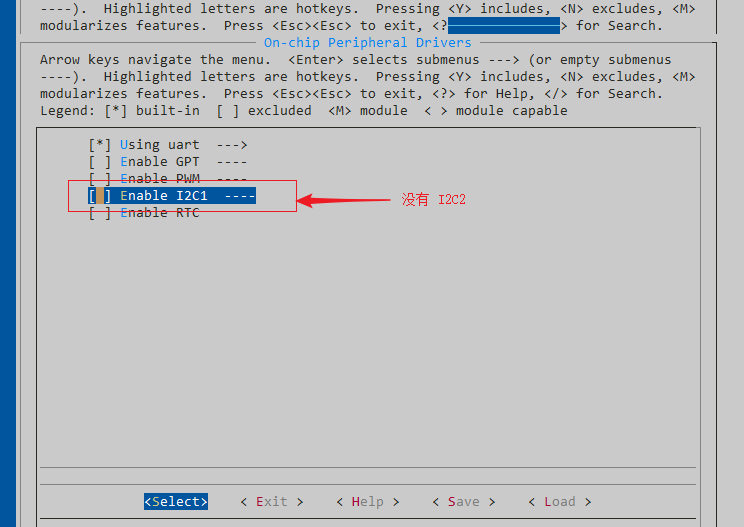

添加 I2C2 的外设支持需要以下几步：

### 1. 打开 MCUXpresso 工程

打开 BSP 的 MCUXpresso 配置文件。

### 2. 按原理图配置 I2C2 的引脚，并生成代码

按图示顺序配置 I2C2，并生成代码。

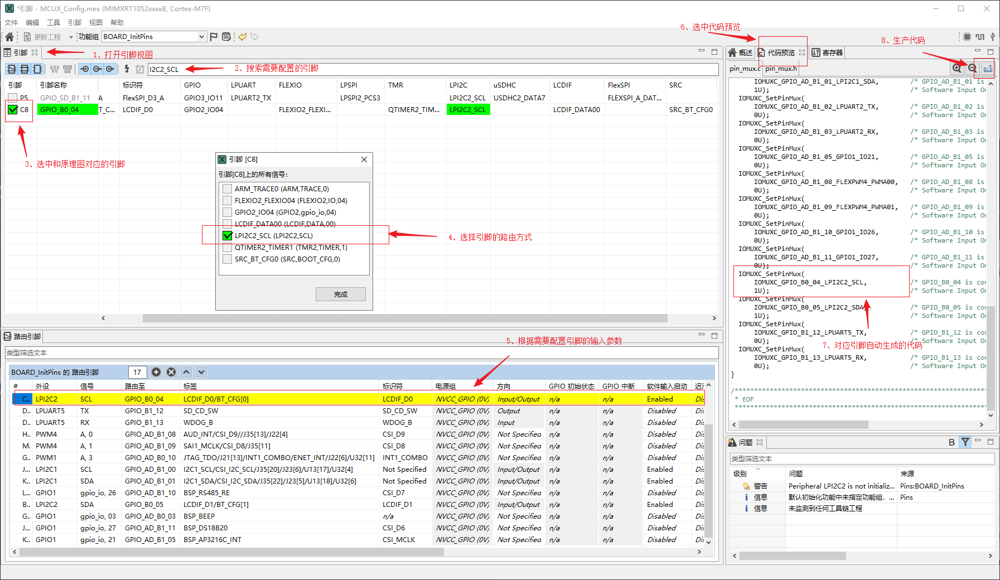

为 BSP 添加驱动时，MCUXpress工具可以快速的完成配置管脚的工作。而外设初始化，中断配置，DMA配置等等则由 RT-Thread 提供的驱动文件来完成。

### 3. 修改 Kconfig 文件

打开 board 文件夹下的 Konfig 文件，拷贝 I2C1 的配置项，并重命名 I2C1 为 I2C2。

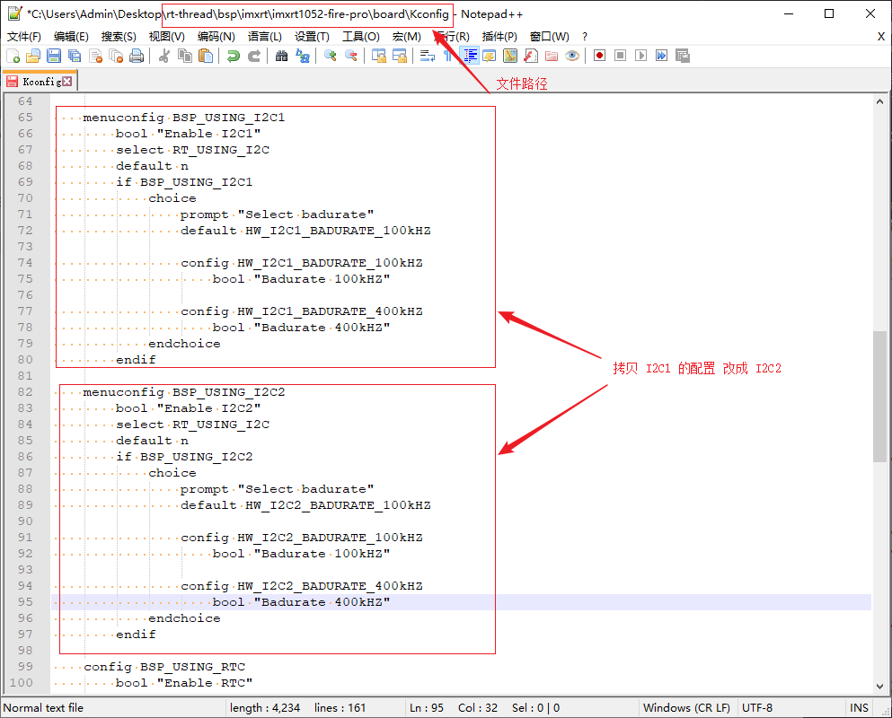

### 4. 重新配置工程

经过上一步的修改，此时重新打开 ENV 工具，在 menuconfig 中就会出现添加的 I2C2 的配置项。

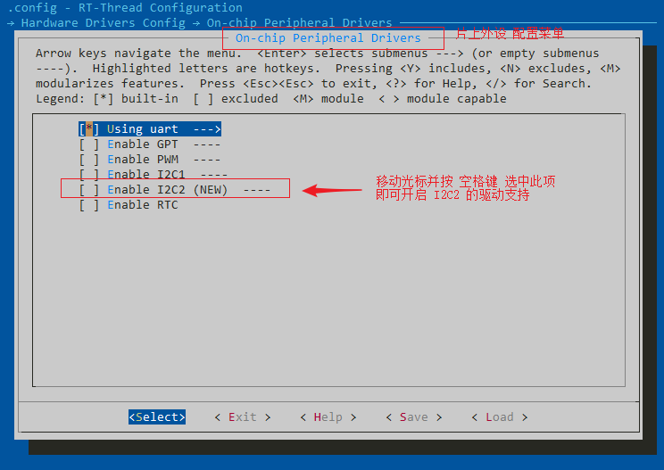

### 5. 生成工程，检查驱动文件

使用 ENV 重新生成工程并打开，检查原有驱动文件是否支持新添加的驱动（查看是否有新驱动的配置文件，中断函数，DMA配置和中断函数等等），如下图所示I2C2对应的代码由之前的灰色变为高亮。

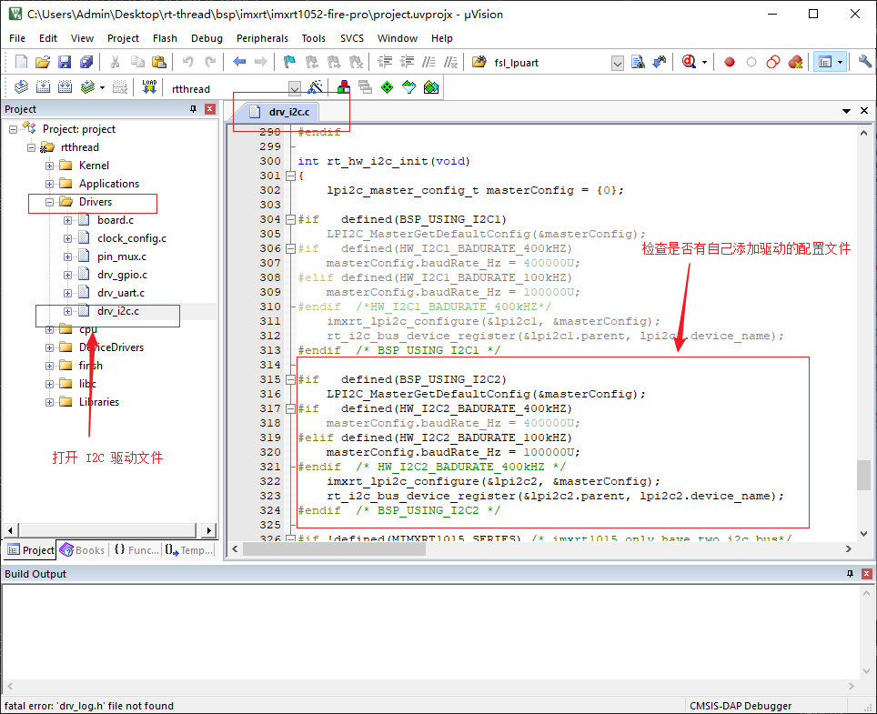

### 6. 编译下载

检查完工程后，编译下载到开发板，程序会自动开始运行。输入 `list_device` 命令，可以看到 I2C2 总线已经注册到内核，说明驱动已经添加成功。

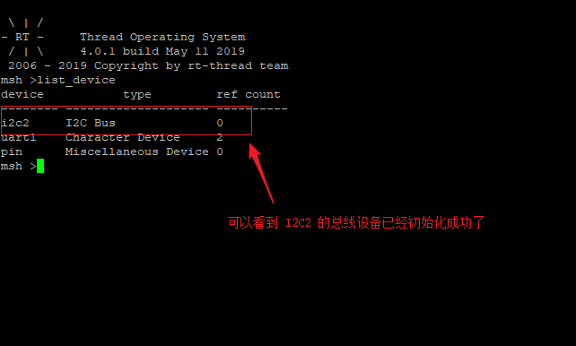

## 4. 注意事项

- 部分驱动如果没有适配 BSP 所属的 i.MX RT 系列，请等待 RT-Thread 团队更新。

  - 驱动文件对 i.MX RT 系列的支持情况可以查看 [i.MX RT系列驱动介绍文档](./IMXRT系列驱动介绍.md)。

- 对于驱动文件或文档说明，有任何建议或者意见，欢迎反馈到 [RT_Thread GitHub](https://github.com/RT-Thread/rt-thread) 网站或 [RT-Thread 官方论坛](https://www.rt-thread.org/qa/forum.php)。

## 5. 附录

### 5.1 外设配置总结

当开发者想要在 BSP 中添加更多驱动时，需要使用 MCUXpresso 工具来配置这些外设。对于绝大多数驱动的配置，只需要在工具中使能相应的外设即可。但是对于一些复杂的外设，则需要更多的配置内容。下表展示了不同驱动在 MCUXpresso 工具配置步骤的总结：

| 序号 | 驱动      | MCUXpresso 工程中的配置情况（**加粗部分为必做步骤**）            |
| :--: | :------- | :----------------------------------------------- |
|  1   | GPIO     | 无需任何操作 |
|  2   | UART     | 配置所需要的引脚（或者使用默认引脚）    |
|  3   | SPI      | 配置所需要的引脚（或者使用默认引脚）    |
|  4   | I2C      | 配置所需要的引脚（或者使用默认引脚）         |
|  5   | GPT(HWTIMER) | 无需任何操作，详细内容可参考5.3章节      |
|  6   | PWM      | 配置所需要的引脚（或者使用默认引脚） ，详细内容可参考5.3章节 |
|  7   | ADC      | 配置所需要的引脚（或者使用默认引脚），详细内容可参考5.3章节  |
|  8   | RTC      | 无需任何操作     |
|  9  | Watchdog | 无需任何操作                        |
|  10  | SDRAM    | 配置所需要的引脚（或者使用默认引脚）    |

### 5.2 复杂外设配置说明

本章节着重介绍配置步骤较为复杂的驱动。

#### 5.2.1 GPT 外设驱动添加说明

 1. 打开 imxrt/imxrt1052-fire-pro/board/Kconfig ，添加 Kconfig 选项。选中自己添加的选项后，生成一遍工程，如下图所示：

 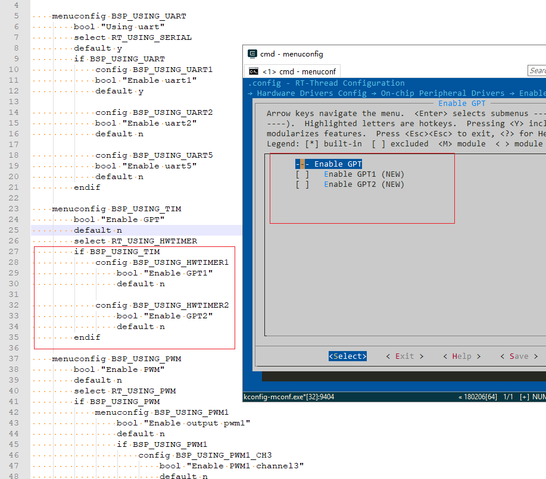

  2. 打开工程进行编译并下载，如下图所示：

 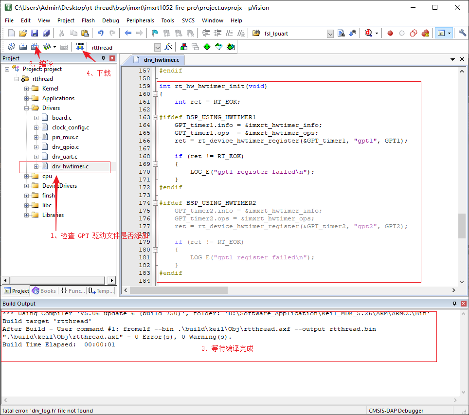

 3. 查看结果，输入 `list_device` 命令，可以看到 gpt1 设备已经注册到内核，说明驱动已经添加成功。

 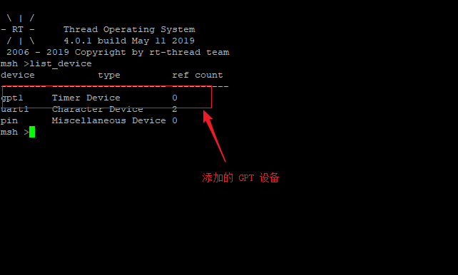

#### 5.2.2 PWM 外设驱动添加说明

 1. 打开 MCUXpresso 工程，设置 PWM 在 MCUXpresso 里的选项，如下图所示：

 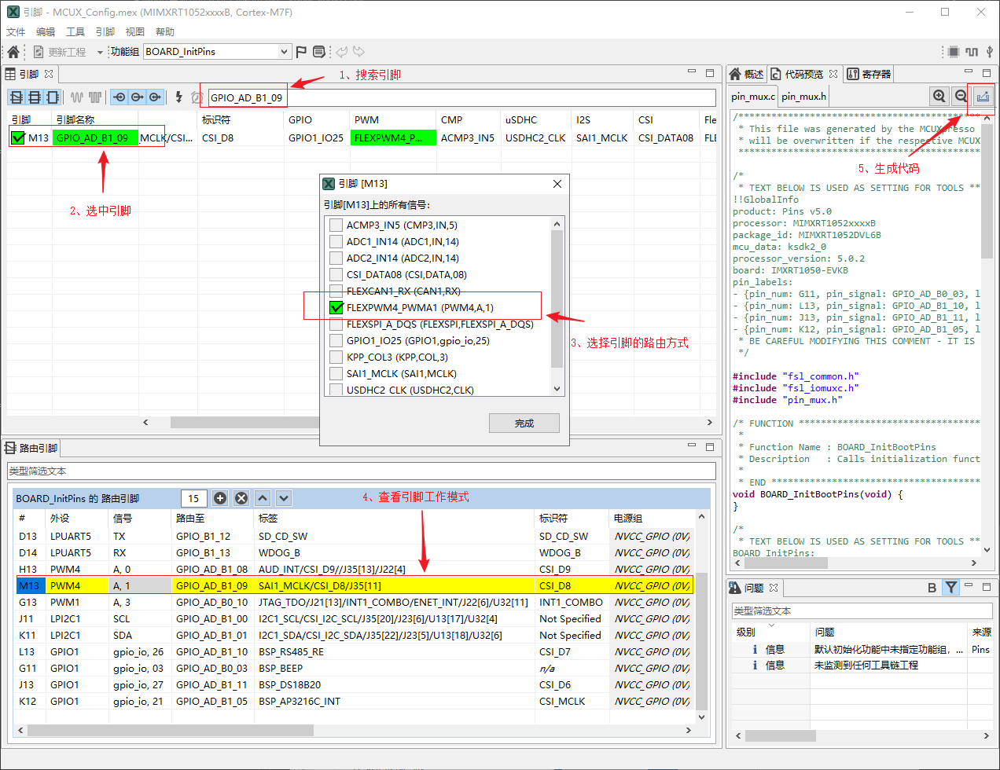

 2. 打开 imxrt/imxrt1052-fire-pro/board/Kconfig ，添加 Kconfig 选项。选中自己添加的选项后，生成一遍工程，如下图所示：

 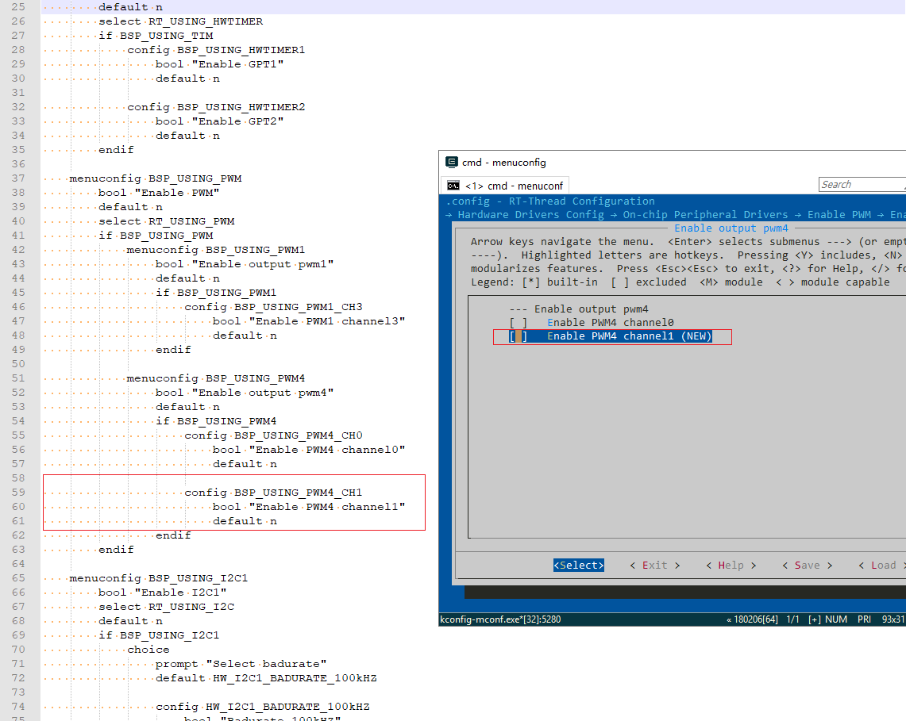

 3. 打开工程进行编译并下载，如下图所示：

 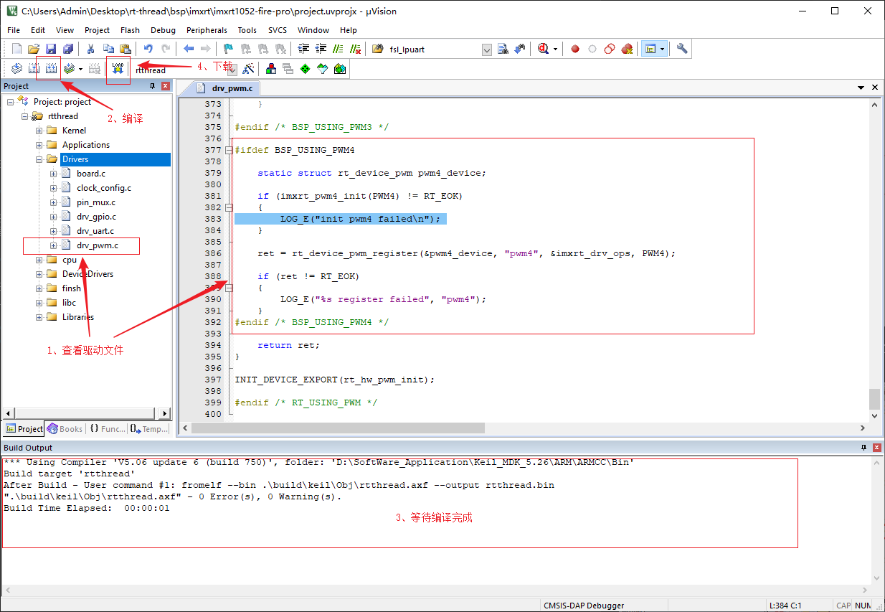

4. 查看结果，输入 `list_device` 命令，可以看到 pwm 设备已经注册到内核，说明驱动已经添加成功。

 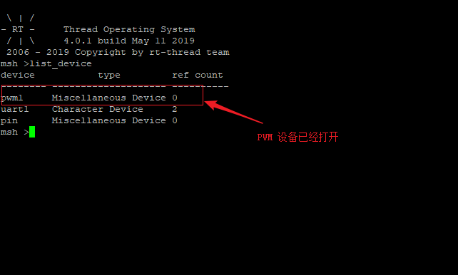

#### 5.2.3 ADC 外设驱动添加说明

 1. 打开 MCUXpresso 工程，设置 ADC 在 MCUXpresso 里的引脚，如下图所示：

 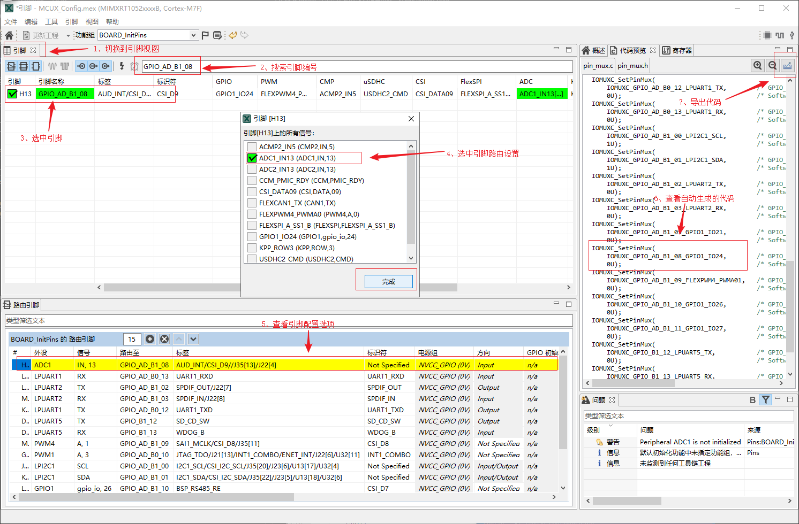

 2. 打开 imxrt/imxrt1052-fire-pro/board/Kconfig ，添加 Kconfig 选项。选中自己添加的选项后，生成一遍工程，如下图所示：

 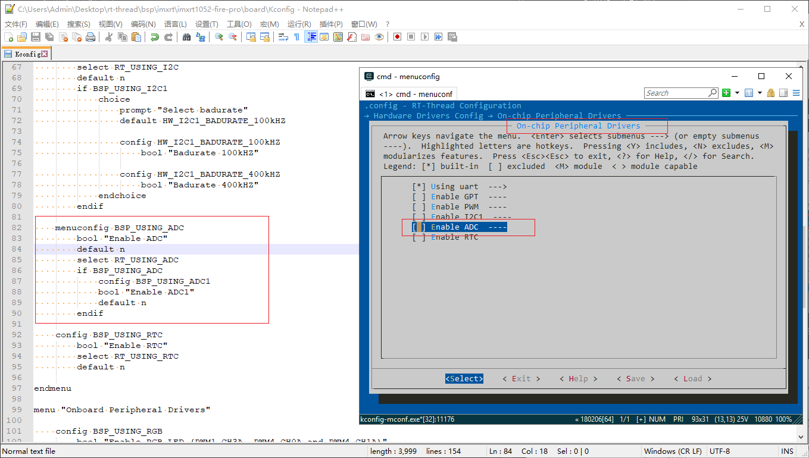

 3. 打开工程进行编译并下载，如下图所示：

 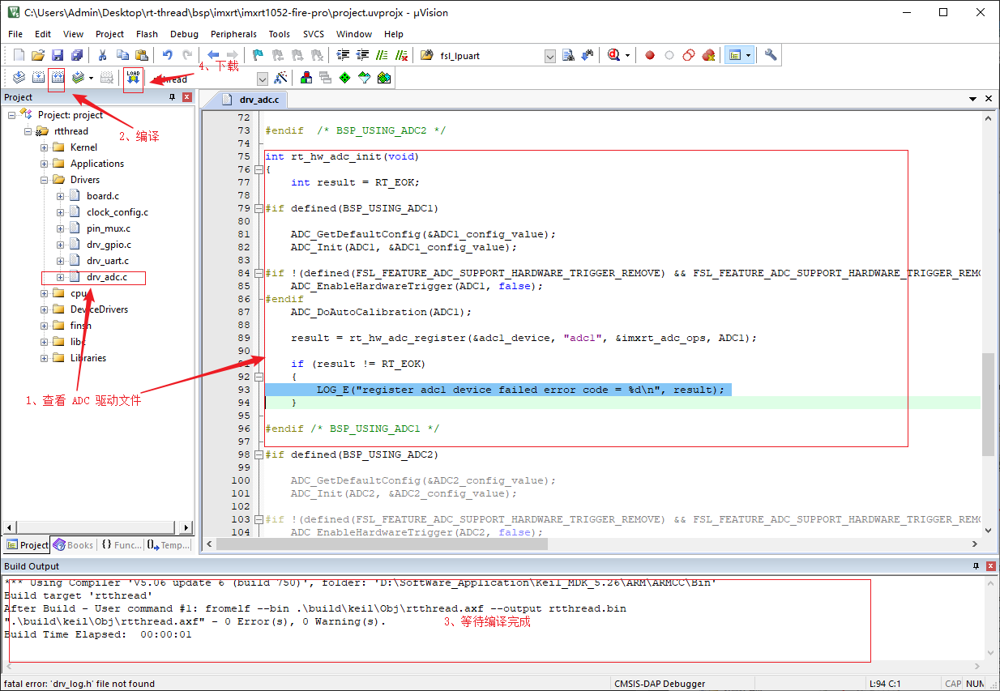

4. 查看结果，输入 `list_device` 命令，可以看到 adc1 设备已经注册到内核，说明驱动已经添加成功。

 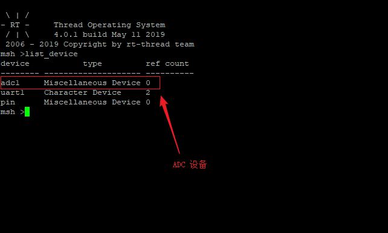
