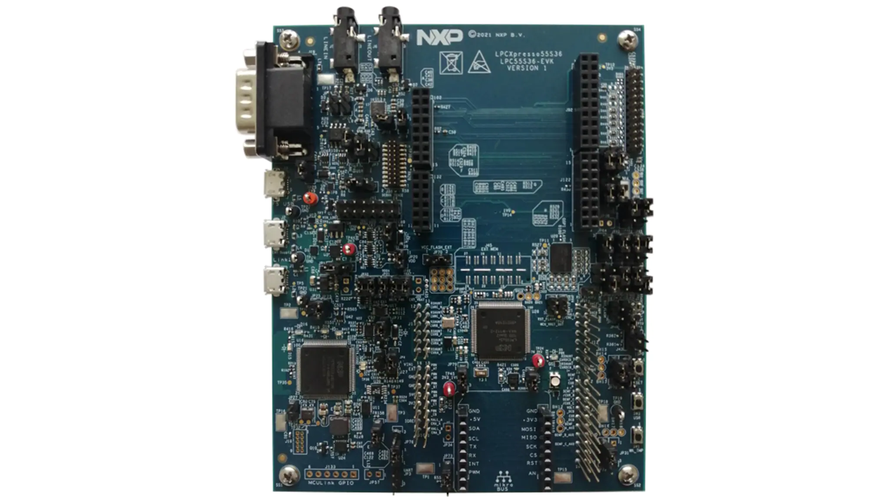

# LPC55S36-EVK 板级支持包

## 1. 简介(Introduction)

LPC55S36 是由恩智浦NXP半导体推出的基于Cortex-M33内核的高性能单片机
包括如下硬件特性：

| 硬件 | 描述 |
| -- | -- |
|芯片型号| LPC5536/LPC55S36 全系列 |
|CPU| Cortex-M33 , with FPU |
|主频| 150MHz |

## 2. 硬件开发环境(Hardware development system)

开发板（EVK）




## 3. 编译说明

支持IDE:

* MDK5: V5.36
* IAR: 9.30.1

1) 下载源码

```bash
    git clone https://github.com/RT-Thread/rt-thread.git
```

2) 配置工程并准备env

（Linux/Mac）

```bash
    cd rt-thread/bsp/lpc55S36_evk
    scons --menuconfig
    source ~/.env/env.sh
    pkgs --upgrade
```

（Windows）

>在[RT-Thread官网][1]下载ENV工具包

3) 配置芯片型号

（Linux/Mac）

```bash
    scons --menuconfig
```

（Windows(ENV环境中)）

```bash
    menuconfig
```

在menuconfig页面配置并选择对应的芯片型号，若开发环境为MDK/IAR，则需要生成工程

4) 生成工程

IAR:

```bash
scons --target=iar
```

MDK5:

```bash
scons --target=mdk5
```

## 3. 烧写及执行

烧写可以使用仿真器 ISP等多种方式 此处不再赘述

### 3.1 运行结果

如果编译 & 烧写无误，会在Flexcomm0串口*上看到RT-Thread的启动logo信息：

```bash
 \ | /
- RT -     Thread Operating System
 / | \     4.0.1 build Jul 30 2019
 2006 - 2019 Copyright by rt-thread team
uising armclang, version: 6120001
msh />
```


## 4. 驱动支持情况及计划

| 驱动       | 支持情况 | 备注                         |
| ---------- | :------: | :--------------------------: |
| UART       | 支持     | UART0/2                 |
| GPIO       | 支持     | 自动根据芯片型号选择引脚布局 |
| SPI        | 支持     | 支持High Speed SPI     |
| USB Device | 不支持 | 暂不支持          |
| USB Host   | 不支持  | 暂不支持      |
| Windowed WatchDog | 不支持  | 支持                        |
| ADC | 不支持 | 暂不支持 |
| I2C       | 支持     | 可配合MMA8562          |
| RTC        | 支持     | RTC时钟自动配置              |

## 5.进阶使用

此 BSP 默认只开启了串口 0 的功能，如果需使用更多高级外设功能，需要利用 ENV 工具对 BSP 进行配置， 步骤如下：

1. 在 bsp 下打开 env 工具。
2. 输入 menuconfig 命令配置工程，配置好之后保存退出。
3. 输入 pkgs --update 命令更新软件包。
4. 输入 scons --target=mdk5/iar 命令重新生成工程。

## 6. 联系人信息

维护人:
alex.yang@nxp.com
